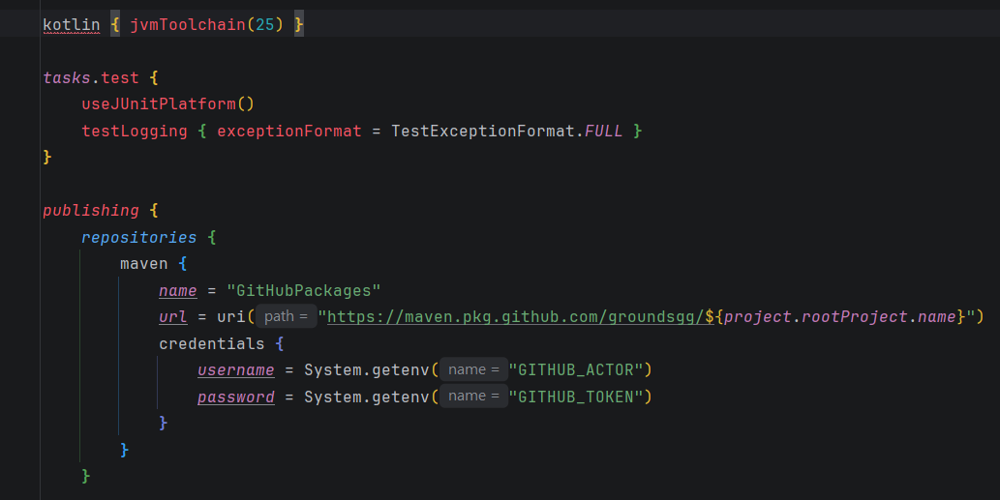

# library-gradle-plugin

Gradle convention plugins for Grounds projects.

## Usage

### Making the plugins available to your project

Add the GitHub Packages repo to `pluginManagement` so Gradle can resolve the
`gg.grounds.*` plugins via the `plugins {}` block.

Kotlin DSL (`settings.gradle.kts`):

```kotlin
pluginManagement {
    repositories {
        maven {
            url = uri("https://maven.pkg.github.com/groundsgg/*")
            credentials {
                username = providers.gradleProperty("github.user").get()
                password = providers.gradleProperty("github.token").get()
            }
        }
        gradlePluginPortal()
    }
}
```

### Add the appropriate convention plugin

For just Kotlin projects (usually the `common` module)

```kotlin
plugins {
    id("gg.grounds.kotlin-conventions") version "VERSION"
}
```

For Paper projects:

```kotlin
plugins {
    id("gg.grounds.paper-conventions") version "VERSION"
}
```

For Velocity projects:

```kotlin
plugins {
    id("gg.grounds.velocity-conventions") version "VERSION"
}
```

## Migration Guide from 0.1.x to 0.2.x

The `gg.grounds.root` plugin does not exist anymore. Remove it.
All necessary configuration is configured by the respective convention plugins.

| Old plugin name | Migration steps                                                                                                                                                                                                                                 | 
| - |-------------------------------------------------------------------------------------------------------------------------------------------------------------------------------------------------------------------------------------------------|
| `gg.grounds.root` | If you have subprojects that apply `gg.grounds.paper` or `gg.grounds.velocity`, just remove the `gg.grounds.root` plugin. <br> If code is only in the `src` directory and you don't need paper or velocity, use `gg.grounds.kotlin-conventions` |
| `gg.grounds.paper` | Use `gg.grounds.paper-conventions` instead                                                                                                                                                                                                      |
| `gg.grounds.velocity` | Use `gg.grounds.velocity-conventions` instead                                                                                                                                                                                                   |

## Plugins Hierarchy


A convention plugin defines shared configuration.
The diagram above shows the relation between the configuration plugins.
The diagram only shows the names without their prefixes.

- `base-conventions`: Setups spotless, common repositories (maven central) and version override 
- `kotlin-conventions`: Setups all Kotlin related configurations
- `paper-base-conventions`: Common configuration for velocity and paper plugins
- `paper-conventions`: Paper server plugin defaults (Paper repo, shadow packaging, Paper API dep, ...)
- `velocity-conventions`: Velocity proxy plugin defaults (Paper repo, shadow packaging, Velocity API deps, BuildConfig, ...)

## Troubleshooting

### IntelliJ underlines some things red



This happens because IntelliJ cannot find the type safe script accessors.
This is only an IntelliJ error, building the plugins does not result in an error.
The error can be fixed by first running `gradle clean`, 
then `gradle generatePrecompiledScriptPluginAccessors` 
and lastly tell IntelliJ to sync the Gradle Project again.

If it still does not work, you can use `configure<EXTENSION CLASS>`.
For that you need to find the name of the Extension Class.
You can either try to guess it (for example, the `spotless` extension probable has spotless in its name).
Alternatively, you can add the plugin to a regular Gradle project, and make CTRL + Left Click to see the Extensions class name.

To make sure it is just an IntelliJ error, try to build (`gradle build`) the project.

```kotlin
// Example to configure spotless (which is equivalent to just write `spotless`) 

configure<SpotlessExtension> {

}
```